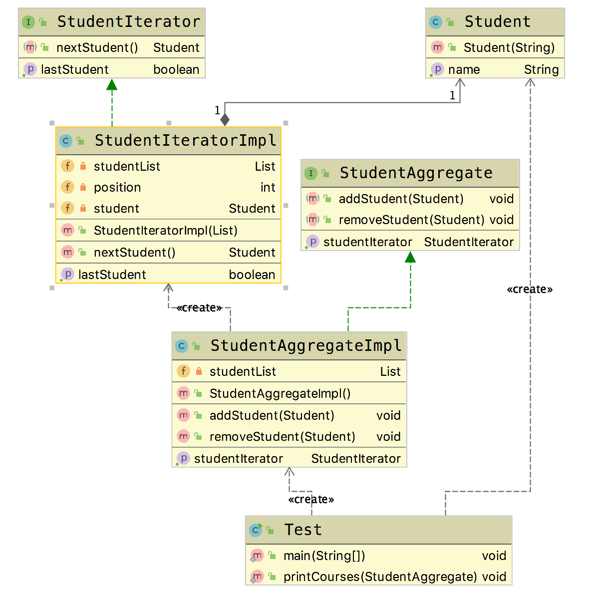

# 迭代器模式(Iterator Pattern)

**迭代器模式(Iterator Pattern)**: 提供一种方法，顺序访问一个集合对象中的各个元素，而又不暴露该对象的内部表示。

## 适用场景

- 访问一个集合对象的内容，而无需暴露它的内部表示。
- 为遍历不同的集合结构提供了一个统一的接口。

## 优点

- 分离了集合对象的遍历行为

## 缺点

- 类的个数成对增加，新增一个集合类，就需要相对应地增加一个迭代器类

迭代器模式在实际使用过程中是经常使用的一种设计模式，但是在实际编程过程中，很少有我们自己去实现一个迭代器，因为编程语言一般就给我们提供了相应集合类的迭代器。

## Golang Demo

下面的示例并不能完全地表示迭代模式，建议参考java版示例。因为没有add和remove方法。实际使用中，我们并不需要亲自来实现，因为了解就可以。

```go
package iterator

type Student struct {
    name string
}

type Iters []Student

func (i Iters) Iterator() *Iterator {

    return &Iterator{
        data:  i,
        index: 0,
    }

}

type Iterator struct {
    data  Iters
    index int
}

func (i *Iterator) HasNext() bool {
    return i.index < len(i.data)
}

func (i *Iterator) Next() (v Student) {
    v = i.data[i.index]
    i.index++
    return v
}

```

```go
package iterator

import (
    "fmt"
    "testing"
)

func Test(t *testing.T) {
    iters := Iters{
        Student{name: "hello"},
        Student{name: "world"},
        Student{name: "!"},
    }

    for it := iters.Iterator(); it.HasNext(); {
        fmt.Println(it.Next())
    }
}

```

## Java Demo

```java
package tech.selinux.design.pattern.behavioral.iterator;

public class Student {
  private String name;

  public Student(String name) {
    this.name = name;
  }

  public String getName() {
    return name;
  }
}

```

```java
package tech.selinux.design.pattern.behavioral.iterator;

public interface StudentAggregate {

  void addStudent(Student student);

  void removeStudent(Student student);

  StudentIterator getStudentIterator();
}

```

```java
package tech.selinux.design.pattern.behavioral.iterator;

import java.util.ArrayList;
import java.util.List;

public class StudentAggregateImpl implements StudentAggregate {

  private List studentList;

  public StudentAggregateImpl() {
    this.studentList = new ArrayList();
  }

  @Override
  public void addStudent(Student student) {
    studentList.add(student);
  }

  @Override
  public void removeStudent(Student student) {
    studentList.remove(student);
  }

  @Override
  public StudentIterator getStudentIterator() {
    return new StudentIteratorImpl(studentList);
  }
}

```

```java
package tech.selinux.design.pattern.behavioral.iterator;

public interface StudentIterator {
  Student nextStudent();

  boolean isLastStudent();
}

```

```java
package tech.selinux.design.pattern.behavioral.iterator;

import java.util.List;

public class StudentIteratorImpl implements StudentIterator {

  private List studentList;
  private int position;
  private Student student;

  public StudentIteratorImpl(List studentList) {
    this.studentList = studentList;
  }

  @Override
  public Student nextStudent() {
    System.out.println("result ,位置是: " + position);
    student = (Student) studentList.get(position);
    position++;
    return student;
  }

  @Override
  public boolean isLastStudent() {
    if (position < studentList.size()) {
      return false;
    }
    return true;
  }
}

```

```java
package tech.selinux.design.pattern.behavioral.iterator;

public class Test {

  public static void main(String[] args) {
    Student student1 = new Student("Student 1");
    Student student2 = new Student("Student 2");
    Student student3 = new Student("Student 3");
    Student student4 = new Student("Student 4");
    Student student5 = new Student("Student 5");
    Student student6 = new Student("Student 6");

    StudentAggregate studentAggregate = new StudentAggregateImpl();

    studentAggregate.addStudent(student1);
    studentAggregate.addStudent(student2);
    studentAggregate.addStudent(student3);
    studentAggregate.addStudent(student4);
    studentAggregate.addStudent(student5);
    studentAggregate.addStudent(student6);

    System.out.println("-----Student list -----");
    printCourses(studentAggregate);

    studentAggregate.removeStudent(student4);
    studentAggregate.removeStudent(student5);

    System.out.println("-----Student list 2-----");
    printCourses(studentAggregate);
  }

  public static void printCourses(StudentAggregate studentAggregate) {
    StudentIterator studentIterator = studentAggregate.getStudentIterator();
    while (!studentIterator.isLastStudent()) {
      Student student = studentIterator.nextStudent();
      System.out.println(student.getName());
    }
  }
}

```

## UML

