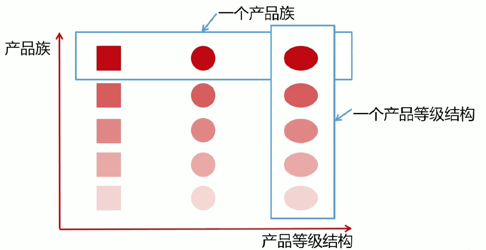
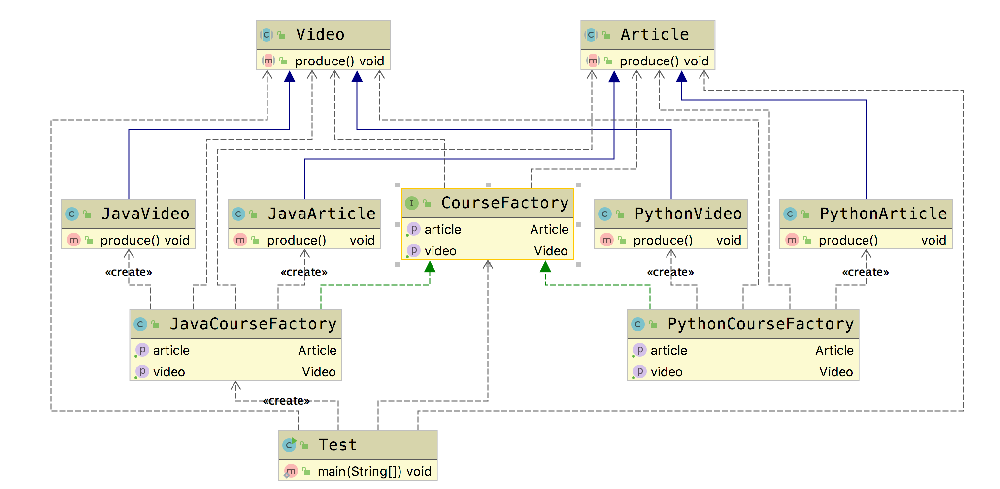

# 抽象工厂模式(Abstract Factory Pattern)

&emsp;&emsp; **抽象工厂模式(Abstract Factory Pattern)**：提供一个创建一系列相关或相互依赖对象的接口，而无须指定它们具体的类。抽象工厂模式又称为Kit模式，它是一种对象创建型模式。

## 适用场景

- 客户端(应用层)不依赖于产品实例，如何被创建、实现等细节
- 强调一系列相关的产品对象（属于同一产品族）一起使用创建对象需要大量重复的代码
- 提供一个产品类的库，所有的产品以同样的接口出现，从而使客户端不依赖于具体实现

## 优点

- 具体产品在应用层代码隔离，无须关心创建细节
- 将一个系列的产品族统一到一起创建

## 缺点

- 规定了所有可能被创建的产品的集合，产品族中扩展新的产品困难，需要修改抽象工厂的接口
- 增加了系统的抽象性和理解难度

## 产品等级和产品族



> (1) 产品等级结构：产品等级结构即产品的继承结构，如一个抽象类是电视机，其子类有海尔电视机、海信电视机、TCL电视机，则抽象电视机与具体品牌的电视机之间构成了一个产品等级结构，抽象电视机是父类，而具体品牌的电视机是其子类。  
> (2) 产品族：在抽象工厂模式中，产品族是指由同一个工厂生产的，位于不同产品等级结构中的一组产品，如海尔电器工厂生产的海尔电视机、海尔电冰箱，海尔电视机位于电视机产品等级结构中，海尔电冰箱位于电冰箱产品等级结构中，海尔电视机、海尔电冰箱构成了一个产品族。  
> https://blog.csdn.net/lovelion/article/details/9319323

## Golang Demo

定义一个产品族以及抽象工厂

```go
package abstractfactory

type Article interface {
    produce()
}

type Video interface {
    produce()
}

type CourseFactory interface {
    getVideo() Video
    getArticle() Article
}
```

```go
package abstractfactory

import "fmt"

type JavaVideo struct {
}

func (JavaVideo) produce() {
    fmt.Println("produce java")
}

type JavaArticle struct {
}

func (JavaArticle) produce() {
    fmt.Println("java 笔记")
}

type JavaCourseFactory struct {
}

func NewJavaCourseFactory() *JavaCourseFactory {
    return &JavaCourseFactory{}
}

func (JavaCourseFactory) getVideo() Video {
    return JavaVideo{}
}

func (JavaCourseFactory) getArticle() Article {
    return JavaArticle{}
}
```

```go
package abstractfactory

import "fmt"

type PythonVideo struct {
}

func (PythonVideo) produce() {
    fmt.Println("produce python")
}

type PythonArticle struct {
}

func (PythonArticle) produce() {
    fmt.Println("python 笔记")
}

type PythonCourseFactory struct {
}

func NewPythonCourseFactory() *PythonCourseFactory {
    return &PythonCourseFactory{}
}

func (PythonCourseFactory) getVideo() Video {
    return PythonVideo{}
}

func (PythonCourseFactory) getArticle() Article {
    return PythonArticle{}
}

```

```go
package abstractfactory

import "testing"

func TestAbstractFactory(t *testing.T) {

    var courseFactory CourseFactory = NewJavaCourseFactory()
    courseFactory.getVideo().produce()
    courseFactory.getArticle().produce()

}

```

## Java Demo

```java
package tech.selinux.design.pattern.creational.abstractfactory;

public abstract class Video {
    public abstract void produce();
}
```

```java
package tech.selinux.design.pattern.creational.abstractfactory;

public abstract class Article {
    public abstract void produce();
}
```

```java
package tech.selinux.design.pattern.creational.abstractfactory;

public interface CourseFactory {
    Video getVideo();
    Article getArticle();
}
```

```java
package tech.selinux.design.pattern.creational.abstractfactory;

public class JavaVideo extends Video {
    @Override
    public void produce() {
        System.out.println("produce java");
    }
}
```

```java
package tech.selinux.design.pattern.creational.abstractfactory;

public class JavaArticle extends Article {
    @Override
    public void produce() {
        System.out.println("Java 笔记");
    }
}
```

```java
package tech.selinux.design.pattern.creational.abstractfactory;

public class JavaCourseFactory implements CourseFactory {
    @Override
    public Video getVideo() {
        return new JavaVideo();
    }

    @Override
    public Article getArticle() {
        return new JavaArticle();
    }
}
```

```java
package tech.selinux.design.pattern.creational.abstractfactory;

public class PythonVideo extends Video {
    @Override
    public void produce() {
        System.out.println("produce python");
    }
}
```

```java
package tech.selinux.design.pattern.creational.abstractfactory;

public class PythonArticle extends Article {
    @Override
    public void produce() {
        System.out.println("Python 笔记");
    }
}
```

```java
package tech.selinux.design.pattern.creational.abstractfactory;

public class PythonCourseFactory implements CourseFactory {
    @Override
    public Video getVideo() {
        return new PythonVideo();
    }

    @Override
    public Article getArticle() {
        return new PythonArticle();
    }
}
```

```java
package tech.selinux.design.pattern.creational.abstractfactory;

public class Test {
    public static void main(String[] args) {
        CourseFactory courseFactory = new JavaCourseFactory();
        Video video = courseFactory.getVideo();
        Article article = courseFactory.getArticle();
        video.produce();
        article.produce();
    }
}
```

## UML

