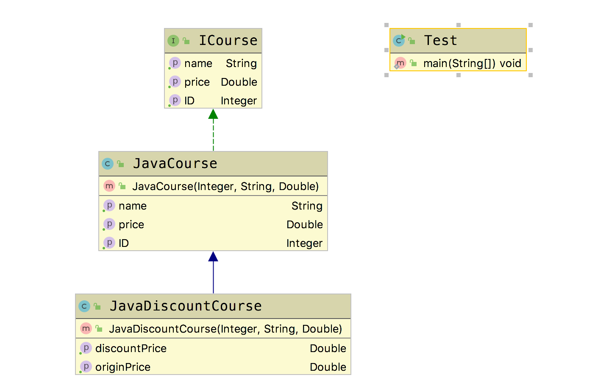

# 开闭原则(Open-Closed Principle, OCP)

## 定义

  **开闭原则(Open-Closed Principle, OCP)** ：一个软件实体如类、模块和函数应当对扩展开放，对修改关闭。即软件实体应尽量在不修改原有代码的情况下进行扩展。  
  用抽象构建框架，用实现扩展细节。  
  优点：提高软件系统的可复用性和可维护性。  

  实现开闭原则的核心思想，就是面向抽象继承。

## Golang Demo

```go
package openclose

type CourseInterface interface {
  GetID() int
  GetName() string
  GetPrice() float32
}
```

```go
package openclose

type JavaCourse struct {
  id    int
  name  string
  price float32
}

func NewJavaCourse(id int, name string, price float32) *JavaCourse {
  return &JavaCourse{id: id, name: name, price: price}
}

func (j *JavaCourse) GetID() int {
  return j.id
}

func (j *JavaCourse) GetName() string {
  return j.name
}

func (j *JavaCourse) GetPrice() float32 {
  return j.price
}
```

```go
package openclose

type JavaDiscountCourse struct {
  JavaCourse
}

func NewJavaDiscountCourse(ID int, name string, price float32) *JavaDiscountCourse {
  return &JavaDiscountCourse{JavaCourse: *NewJavaCourse(ID, name, price)}
}

func (j *JavaDiscountCourse) GetOriginPrice() float32 {
  return j.GetPrice()
}

func (j *JavaDiscountCourse) GetDiscountPrice() float32 {
  return j.GetPrice() * 0.8
}

```

```go
package openclose

import (
    "testing"
)

func TestOpenClose(t *testing.T) {

    course := NewJavaDiscountCourse(1, "JavaEE", 10)
    t.Logf("\nid:%d,\n名称:%s,\n价格:%f,\n折后价格:%f\n", course.GetID(), course.GetName(), course.GetPrice(), course.GetDiscountPrice())

}

```

## Java Demo

```java
package tech.selinux.design.principle.openclose;

public interface ICourse {
  Integer getID();
  String getName();
  Double getPrice();
}
```

```java
package tech.selinux.design.principle.openclose;

public class JavaCourse implements ICourse {
  private Integer ID;
  private String Name;
  private Double Price;

  public JavaCourse(Integer id, String name, Double price) {
    this.ID = id;
    this.Name = name;
    this.Price = price;
  }

  @Override
  public Integer getID() {
    return ID;
  }

  @Override
  public String getName() {
    return Name;
  }

  @Override
  public Double getPrice() {
    return Price;
  }
}
```

```java
package tech.selinux.design.principle.openclose;

public class JavaDiscountCourse extends JavaCourse {

  public JavaDiscountCourse(Integer id, String name, Double price) {
    super(id, name, price);
  }
  public Double getOriginPrice() {
    return super.getPrice() ;
  }

  public Double getDiscountPrice() {
    return super.getPrice() * 0.8;
  }
}
```

```java
package tech.selinux.design.principle.openclose;

public class Test {
  public static void main(String[] args) {
    ICourse iCourse = new JavaDiscountCourse(96, "Java", 348d);
    JavaDiscountCourse javaCourse = (JavaDiscountCourse) iCourse;
    System.out.println(
        "ID:"
            + javaCourse.getID()
            + " 名称:"
            + javaCourse.getName()
            + " 原价:"
            + javaCourse.getOriginPrice()
            + " 折后价格:"
            + javaCourse.getDiscountPrice()
            + "元");
  }
}
```

## UML


